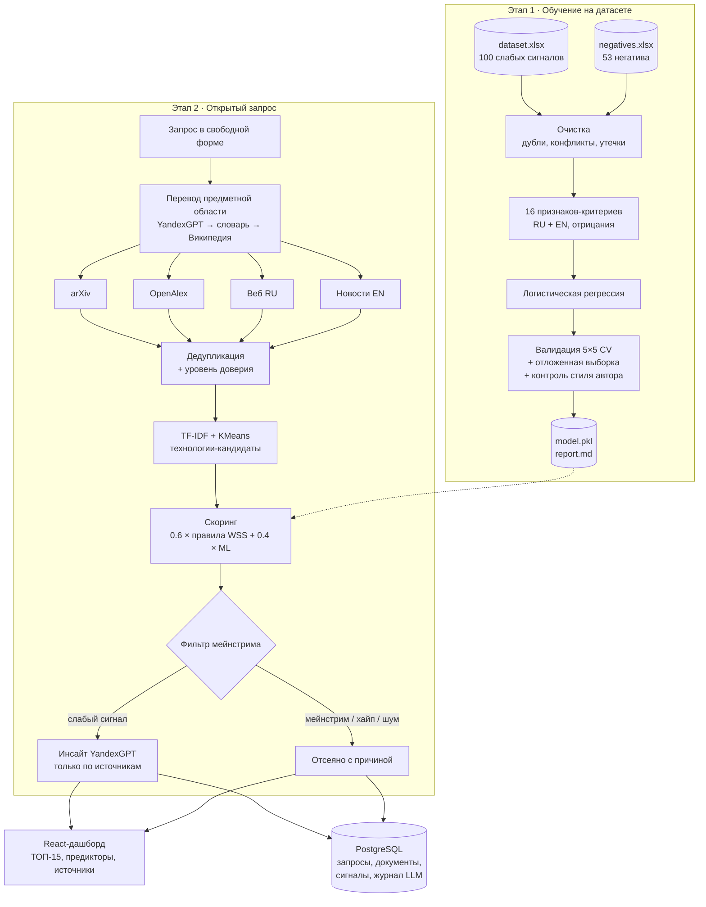

# Архитектура

Сбор данных, аналитика, модель, LLM-слой и интерфейс разделены на модули и Docker-сервисы.
PlantUML-версия схемы: [architecture.puml](architecture.puml).

## Сервисы Docker Compose

| Сервис | Образ | Порт | Назначение |
|---|---|---|---|
| `web` | node → nginx | 3000 | React-дашборд, прокси `/api` |
| `api` | python:3.11 | 8000 | FastAPI: поиск, история, инсайты |
| `db` | postgres:16 | 5433 | хранение запросов и результатов |
| `train` | python:3.11 | — | обучение модели (`docker compose run --rm train`) |
