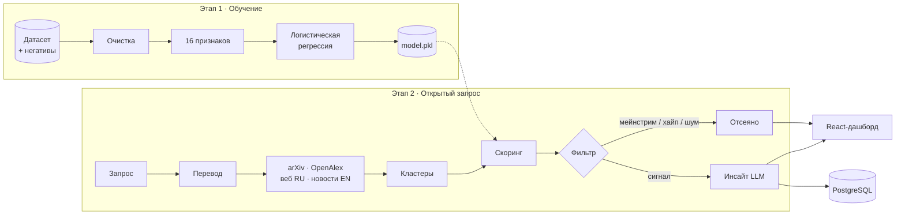

# Техническая документация «Радар слабых сигналов»

Сервис автоматизированного сбора и анализа зарождающихся трендов в научно-технологических отраслях.
Кейс Газпромбанк.Тех · Лидеры цифровой трансформации 2026.

**Содержание**
1. [Назначение](#1-назначение)
2. [Архитектура](#2-архитектура)
3. [Пайплайн обработки данных](#3-пайплайн-обработки-данных)
4. [Методология отбора признаков](#4-методология-отбора-признаков)
5. [Модель и валидация](#5-модель-и-валидация)
6. [Скоринг, фильтр и доверие к источникам](#6-скоринг-фильтр-и-доверие-к-источникам)
7. [LLM-слой](#7-llm-слой)
8. [Хранение данных](#8-хранение-данных)
9. [API](#9-api)
10. [Развёртывание](#10-развёртывание)
11. [Ограничения и развитие](#11-ограничения-и-развитие)

---

## 1. Назначение

Сервис принимает технологическое направление в свободной форме («перспективные решения в финтехе»),
ищет по открытым источникам ранние технологии, отделяет их от мейнстрима, маркетингового хайпа и
информационного шума и формирует ТОП-15 слабых сигналов. Для каждого сигнала показаны описание,
потенциальное преимущество, кейс-пример, источники, уверенность модели и объяснение, по каким признакам
технология отнесена к слабым сигналам.

**Слабый сигнал** — технология, у которой одновременно:

| Условие | Что проверяем |
|---|---|
| Ранняя стадия | концепция, прототип, пилот, первые внедрения |
| Динамика | упоминаний мало, но они растут |
| Доказательная база | статьи, препринты, патенты, гранты, ранние инвестиции |
| Рынок не сформирован | нет выраженных лидеров, стандартов, массового спроса |

Исключаются три класса: **мейнстрим** (массовое внедрение, стандарты, лидеры), **хайп**
(медийная активность выше реальной стадии), **шум** (подборки, рейтинги, прогнозы — не технология).

---

## 2. Архитектура



Подробная схема: [architecture.md](architecture.md), PlantUML: [architecture.puml](architecture.puml).

### Сервисы

| Сервис | Технология | Порт | Роль |
|---|---|---|---|
| `web` | React 18 + Vite, nginx | 3000 | дашборд, прокси `/api` → `api` |
| `api` | Python 3.11, FastAPI | 8000 | поиск, скоринг, история, инсайты |
| `db` | PostgreSQL 16 | 5433 (localhost) | запросы, документы, сигналы, журнал LLM |
| `train` | Python 3.11 | — | обучение модели по требованию |

### Модули

| Модуль | Ответственность |
|---|---|
| `collectors/query.py` | выделение предметной области и перевод запроса |
| `collectors/*_collector.py` | сборщики arXiv, OpenAlex, веб, новости — независимы друг от друга |
| `collectors/pipeline.py` | параллельный сбор, дедупликация, кластеризация |
| `ml/dataset.py`, `ml/features.py`, `ml/train.py` | очистка датасета, признаки, обучение и отчёт |
| `ml/inference.py`, `ml/predict.py` | вероятность и вклад признаков; прогон по файлу |
| `scoring/` | правила WSS, фильтр мейнстрима, уровни доверия |
| `analysis/cards.py` | сборка карточки сигнала |
| `llm/` | роутер разрешённых моделей YandexGPT и промпты |
| `db/` | схема и сохранение в PostgreSQL |
| `api/main.py` | HTTP API |
| `web/` | интерфейс |

---

## 3. Пайплайн обработки данных

### 3.1. Этап 1 — обучение на датасете

| Шаг | Реализация | Детали |
|---|---|---|
| Загрузка | `ml/dataset.py` | xlsx / CSV / JSON; строка шапки находится автоматически, колонки сопоставляются по смыслу |
| Негативные примеры | `data/negatives.xlsx` | 53 строки, разметка командой по протоколу: мейнстрим 34, хайп 11, шум 8 |
| Очистка | `clean_text` | markdown-ссылки и URL удаляются, пробелы нормализуются, `ё → е` |
| Дедупликация | `load_training` | дубли по нормализованному названию; строки с противоречивыми метками удаляются |
| Защита от утечек | `build_text` | не подаются «Почему это (не) слабый сигнал», «Балл», числовые шкалы, ссылки |
| Признаки | `ml/features.py` | 16 признаков-критериев (раздел 4) |
| Обучение и отчёт | `ml/train.py` | сравнение моделей, валидация, `report.md`, `metrics.json`, `model.pkl` |

**Вход модели:** название технологии, область, компании, стадия развития, тренд упоминаний.
Колонка с обоснованием не подаётся: в ней разметчик прямо пишет ответ, а в реальном поиске такого поля нет.

### 3.2. Этап 2 — открытый запрос

| Шаг | Реализация | Детали |
|---|---|---|
| 1. Перевод запроса | `collectors/query.py` | служебные слова убираются; перевод: YandexGPT Lite 5 → словарь предметных областей → межъязыковые ссылки Википедии |
| 2. Сбор | `collectors/` | параллельно: arXiv (точная фраза, 2 года, по релевантности), OpenAlex (3 года, с аннотацией), веб RU, новости EN о стартапах за год; до 25 документов на источник |
| 3. Нормализация | `SourceDoc` | название, ссылка, площадка, дата, тип, язык, уровень доверия, аннотация |
| 4. Дедупликация | `pipeline.collect` | по URL и нормализованному заголовку |
| 5. Кандидаты | `cluster_to_candidates` | TF-IDF (1–2-граммы, RU+EN стоп-слова) + KMeans; название — центральный документ кластера, ключевые фразы — теги |
| 6. Скоринг | `analysis/cards.py` | правила WSS + ML-модель (раздел 6) |
| 7. Фильтр | `scoring/maturity_filter.py` | мейнстрим / хайп / шум / пониженная достоверность — с причиной |
| 8. Инсайт | `llm/router.py` | описание, преимущество, кейс, обоснование — только по источникам кластера |
| 9. Сохранение | `db/store.py` | запрос, документы, карточки, журнал вызовов LLM |

Типичный запрос: 60–75 источников, 20–25 кандидатов, ТОП-15 сигналов за 3–4 секунды (без LLM).

---

## 4. Методология отбора признаков

### Принципы

1. **Признак = критерий ТЗ.** Признаки выведены из определения слабого сигнала и требований исключить
   зрелые технологии, хайп и шум, а не подобраны под обучающую выборку.
2. **Один набор признаков для датасета и открытого поиска.** Двуязычные словари маркеров (RU + EN)
   одинаково работают на аналитических справках и на аннотациях arXiv/OpenAlex.
3. **Отрицания.** Маркер в отрицании («стандартов закупки ещё нет») засчитывается в противоположный
   признак — это признак незрелого рынка, а не зрелого.
4. **Ограниченная шкала.** Значение — число разных сработавших маркеров, от 0 до 3. Длинный текст не даёт
   признаку неограниченного веса.

### Признаки и веса модели

Вес — коэффициент логистической регрессии на стандартизированном признаке: положительный тянет к слабому
сигналу, отрицательный — от него.

| Группа | Признак | Примеры маркеров | Вес |
|---|---|---|---|
| Стадия | Ранняя стадия | концепция, прототип, пилот, PoC, prototype | +1,13 |
| Стадия | Первые внедрения | раннее внедрение, первые клиенты, early adopters | +0,77 |
| Динамика | Рост упоминаний | растёт, рост, growing | +1,44 |
| Динамика | Кратный рост | быстро, кратный, скачкообразно, surge | +0,49 |
| Динамика | Спад интереса | стабильный, снижается, закрыт, снят с рынка, obsolete | −1,04 |
| Доказательства | Научная база | препринт, arXiv, патент, конференция, journal | +0,28 |
| Доказательства | Ранние инвестиции | seed, Series A, грант, стартап | +0,53 |
| Доказательства | Нет подтверждения | без публикаций, не подтверждено, только заявления | −0,55 |
| Рынок | Рынок не сформирован | ещё нет, нишевый, единичные, emerging | +0,23 |
| Рынок | Массовое внедрение | массовое, зрелый, де-факто, widely adopted | −0,91 |
| Рынок | Стандарты | ISO, ГОСТ, IEEE, регулятор, compliance | −0,49 |
| Рынок | Лидеры рынка | лидеры рынка, доля рынка, гиперскейлеры | +0,02 |
| Рынок | Зрелый бизнес | IPO, поглощение, миллионы пользователей | +0,08 |
| Шум | Хайп-маркеры | революция, «убийца X», гарантированно | −0,28 |
| Шум | Только реклама | пресс-релиз, соцсети, маркетинг | −0,32 |
| Шум | Не технология | подборка, рейтинг, прогноз рынка, каталог | −0,95 |

Знаки весов совпали с методологией. Признаки «Лидеры рынка» и «Зрелый бизнес» получили вес около нуля:
в стадиях и трендах обучающей выборки они почти не встречаются. В открытом поиске их роль берут на себя
правила фильтра (раздел 6).

### Что отвергли и почему

| Вариант | Причина |
|---|---|
| Подавать колонку «Почему это (не) слабый сигнал» | в ней записан ответ; accuracy выросла бы до 0,994, но это нечестная цифра |
| Колонка «Балл» и числовые шкалы | у позитивов и негативов их ставили разные люди |
| TF-IDF как основная модель | запоминает конкретные слова и названия, хуже переносится на открытый поиск |

---

## 5. Модель и валидация

**Модель:** `StandardScaler` → `LogisticRegression(class_weight="balanced")` на 16 признаках.
**Данные:** 153 наблюдения — 100 слабых сигналов организаторов и 53 негатива команды.
**Валидация:** 5×5 стратифицированная кросс-валидация (25 разбиений) и отложенные 20%.

### Метрики итоговой модели

| Accuracy | Precision | Recall | F1 |
|---|---|---|---|
| 0,988 ± 0,016 | 0,991 ± 0,019 | 0,992 ± 0,018 | 0,991 ± 0,012 |

Отложенная выборка: 31 из 31 верно (11 негативов, 20 сигналов).

### Сравнение моделей (accuracy, 5×5 CV)

| Модель | Accuracy |
|---|---|
| Контроль: только длина текста | 0,975 |
| **16 признаков + логистическая регрессия (итоговая)** | **0,988** |
| TF-IDF + логистическая регрессия | 0,994 |
| Признаки + TF-IDF | 0,990 |

Точность всех моделей в пределах погрешности, итоговая выбрана по интерпретируемости и переносимости.

### Контроль стиля автора

Позитивы и негативы писали разные люди, тексты позитивов почти вдвое длиннее (медиана 353 против 208 символов).
Модель могла бы научиться отличать авторов, а не классы. Проверка:

| Вход | Только длина | Итоговая модель | TF-IDF |
|---|---|---|---|
| Полный текст | 0,975 | 0,988 | 0,994 |
| Суть стадии и тренда (длина выровнена) | 0,604 | **0,994** | 0,994 |
| Только название, область и компании | 0,921 | **0,514** | 0,738 |

Когда длина ничего не подсказывает, итоговая модель сохраняет точность. По одним названиям класс не угадывает,
то есть на стиль автора и конкретные имена не опирается.

### Интерпретируемость

Вклад признака в решение = вес × стандартизированное значение. В карточке сигнала показываются сработавшие
признаки с их вкладом и значения правил, поэтому видно, почему модель поставила именно такую уверенность.

Полный отчёт: [`ml/artifacts/report.md`](../ml/artifacts/report.md). Переобучение: `docker compose run --rm train`.
Прогон по новому файлу (например, закрытому датасету): `python -m ml.predict --data <файл>`.

---

## 6. Скоринг, фильтр и доверие к источникам

### Итоговая уверенность

```
уверенность = 0,6 × правила WSS + 0,4 × ML-модель
```

### Правила WSS (`scoring/weak_score.py`)

| Компонент | Вес | Как считается |
|---|---|---|
| Новизна | 0,30 | `1 − log(1+n) / log(31)`, n — документов в кластере: чем меньше упоминаний, тем выше |
| Свежесть | 0,25 | доля публикаций не старше 18 месяцев |
| Разнообразие | 0,15 | число типов источников и документов — защита от вброса из одного канала |
| Научная база | 0,15 | доля источников высокого доверия |
| Штраф за зрелость | −0,35 | маркеры стандартов, лидеров рынка, массового внедрения |
| Штраф за хайп | −0,25 | маркетинговые формулировки |

Положительная часть нормируется на сумму весов (0,85), затем вычитаются штрафы, результат ограничен отрезком 0–1.

### Фильтр мейнстрима (`scoring/maturity_filter.py`)

Правила применяются по порядку, первое сработавшее даёт вердикт и причину.

| Условие | Вердикт |
|---|---|
| Большинство заголовков — подборки, ленты новостей, «тренды 2026», прогнозы рынка | шум |
| Все документы — обзорные статьи | мейнстрим: тема уже систематизирована |
| Маркеры ISO/ГОСТ, отраслевого стандарта, лидеров рынка, массового внедрения | мейнстрим |
| Модель уверена, что это не сигнал (< 35%), и главный отрицательный признак — зрелость или шум | мейнстрим или шум по признаку |
| Только блоги, соцсети и агрегаторы | пониженная достоверность (остаётся в выдаче с пометкой) |
| Единственный источник без научного подтверждения | шум |
| Хайп-маркеры без научной базы | шум |
| Иначе | слабый сигнал |

### Уровни доверия (`scoring/trust.py`)

| Уровень | Типы источников |
|---|---|
| Высокий | госорганы, университеты, патенты, научные статьи, конференции, реестры |
| Средний | отраслевые СМИ, аналитические отчёты, сайты компаний |
| Пониженный | блоги, соцсети, агрегаторы, пресс-релизы |

Для каждого источника отображаются наименование, ссылка, дата, тип, язык оригинала и уровень доверия.

---

## 7. LLM-слой

| Задача | Модель | Промпт |
|---|---|---|
| Перевод и нормализация запроса | YandexGPT Lite 5 (`yandexgpt-lite/latest`) | `QUERY_EXPAND` |
| Русское резюме зарубежного источника | YandexGPT Lite 5 | `SUMMARIZE` |
| Инсайт: название, описание, преимущество, кейс, обоснование | YandexGPT Pro 5.1 (`yandexgpt/rc`) | `HYPOTHESIS` |

- Используются только модели из разрешённого ТЗ списка; выбор модели фиксирован по задаче.
- Промпты разрешают писать только по приложенным источникам со ссылками `[id]`.
- Модель указывается в каждой карточке и у каждого резюме; вызовы пишутся в таблицу `llm_log`
  (модель, назначение, хеш промпта, успех).
- Итоговая выдача не формируется из знаний модели: кандидаты, скоринг и фильтр работают без LLM.
- Без доступа к API сервис работает в экстрактивном режиме: цитаты из источников с пометкой языка оригинала.

---

## 8. Хранение данных

Схема: [`db/schema.sql`](../db/schema.sql). Применяется при старте API и идемпотентна.

| Таблица | Содержимое |
|---|---|
| `searches` | запрос, перевод, счётчики, модель LLM, время выполнения, метаданные выдачи |
| `documents` | сырые документы: название, ссылка, дата, площадка, тип, язык, доверие, аннотация |
| `signals` | карточки сигналов и исключённых кандидатов: скоринг, предикторы, вердикт, причина, полный JSON карточки |
| `llm_log` | журнал вызовов LLM |

Любой прошлый запрос открывается из истории без повторного поиска.

---

## 9. API

| Метод | Путь | Назначение |
|---|---|---|
| `POST` | `/search` | открытый запрос → ТОП-15 и отсеянные кандидаты |
| `GET` | `/history` | последние запросы |
| `GET` | `/searches/{id}` | выдача прошлого запроса из базы |
| `GET` | `/signals/{id}` | карточка сигнала (страница инсайта) |
| `GET` | `/status` | статус модели, LLM и базы |
| `GET` | `/health` | проверка живости |

Пример запроса:
```bash
curl -X POST localhost:8000/search -H "Content-Type: application/json" \
     -d '{"query": "перспективные решения в финтехе", "top_k": 15}'
```

Структура ответа (сокращённо):
```json
{
  "query": "перспективные решения в финтехе",
  "translation": {"en": "fintech", "method": "словарь предметных областей"},
  "stats": {"sources": 63, "candidates": 21, "signals": 15, "confident": 4, "rejected": 6},
  "signals": [{
    "rank": 1, "name": "…", "score_pct": 79, "status_ru": "Слабый сигнал",
    "chips": ["Рост упоминаний", "Рынок не сформирован", "Свежие публикации"],
    "description": "…", "advantage": "…", "case": {"text": "…", "url": "…"}, "why": ["…"],
    "predictors": [{"label": "Ранняя стадия", "effect": "+", "value": 0.72, "source": "модель"}],
    "score_parts": {"rules": 0.74, "ml": 0.95, "formula": "0.6 × правила + 0.4 × модель"},
    "sources": [{"title": "…", "url": "…", "date": "2026-03-25", "type_ru": "Научная статья",
                 "lang": "EN", "trust_ru": "Высокое", "summary": "…", "summary_note": "…"}]
  }],
  "rejected": [{"name": "…", "status_ru": "Исключён: зрелая технология", "status_reason": "…"}]
}
```

Интерактивная документация: http://localhost:8000/docs.

---

## 10. Развёртывание

Требования: Docker Desktop (или Docker Engine + Compose v2), Git.

```bash
git clone https://github.com/vladislavlapkin/radar_weak_signal.git
cd radar_weak_signal
cp .env.example .env          # Windows: copy .env.example .env
docker compose up --build -d
```

Дашборд — http://localhost:3000, API — http://localhost:8000/docs. Обученная модель входит в репозиторий.

### Переменные окружения

| Переменная | Назначение |
|---|---|
| `YANDEX_API_KEY`, `YANDEX_FOLDER_ID` | доступ к YandexGPT; сервисному аккаунту нужна роль `ai.languageModels.user` на каталог |
| `YANDEX_LITE_MODEL`, `YANDEX_PRO_MODEL` | модели: `yandexgpt-lite/latest`, `yandexgpt/rc` |
| `POSTGRES_USER`, `POSTGRES_PASSWORD`, `POSTGRES_DB` | база данных; на демо-стенде замените пароль |

### Обучение

```bash
# положите датасет организаторов в data/dataset.xlsx
docker compose run --rm train
docker compose restart api
```

---

## 11. Ограничения и развитие

**Ограничения**
- Метрики посчитаны на выборке, где негативы размечены командой; окончательная проверка — закрытый датасет организаторов.
- Без доступа к YandexGPT названия и цитаты зарубежных источников остаются на языке оригинала (с пометкой).
- Кластеризация по TF-IDF может объединять близкие, но разные технологии в один кандидат.

**Развитие**
1. Дополнительные ранние индикаторы: патенты (ФИПС, Espacenet), GitHub, вакансии, гранты, госзакупки.
2. Динамика во времени: ежемесячные срезы по каждому сигналу.
3. Human-in-the-loop: оценки аналитиков для дообучения модели.
4. Извлечение сущностей: компании и исследовательские группы как отдельные объекты.
5. Расширение разметки негативов до 100–150 строк и перекрёстная разметка вторым экспертом.
